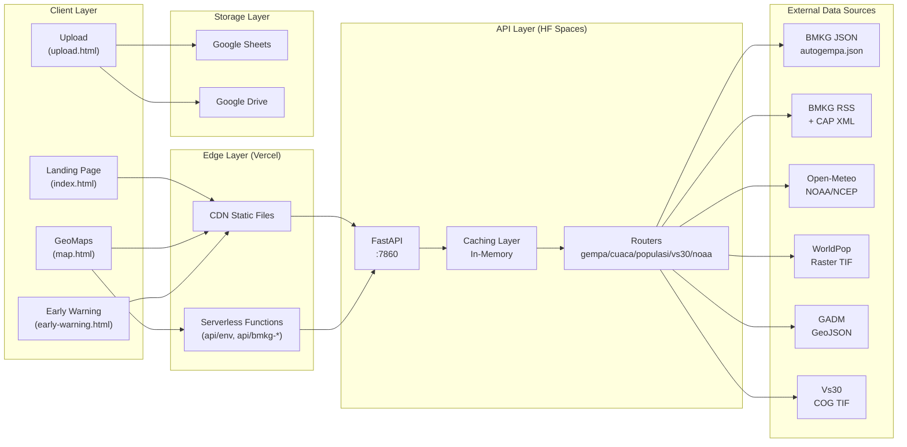
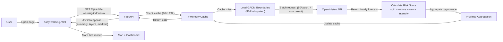
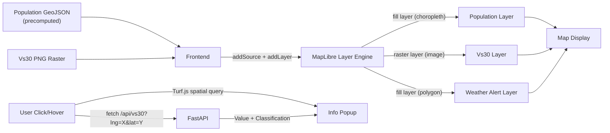
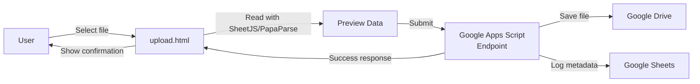
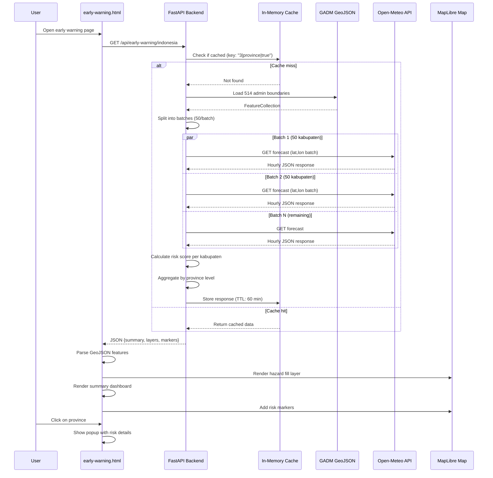

# System Design — Bentala Nusantara

> Architecture-level documentation for Bentala Nusantara WebGIS.
> Versi 1.0 — Juni 2026

---

## 1. System Overview

Bentala Nusantara adalah WebGIS yang mengintegrasikan data kebencanaan dari BMKG (gempa, cuaca) dan Open-Meteo (prakiraan cuaca/NOAA) dengan data geospasial statis (WorldPop, GADM, Vs30) untuk menyajikan visualisasi risiko bencana di peta interaktif.

Sistem terdiri dari tiga komponen utama:
1. **Frontend (Vercel)** — Halaman HTML statis + MapLibre GL + serverless functions
2. **Backend (Hugging Face Spaces)** — FastAPI Python + Rasterio untuk geoprocessing
3. **Storage (Google Workspace)** — Google Sheets + Drive untuk data partisipatif

---

## 2. High-Level Architecture

```
┌─────────────────────────────────────────────────────────────────────┐
│                          CLIENT LAYER                               │
│                                                                     │
│   Browser: index.html | map.html | early-warning.html | upload.html │
│            MapLibre GL | Turf.js | Tailwind CSS                     │
└──────────────────────────┬──────────────────────────────────────────┘
                           │
                    HTTPS fetch()
                           │
                ┌──────────┴──────────┐
                │   EDGE LAYER        │
                │   Vercel CDN        │
                │   + Serverless Fn   │
                │   (/api/env.js)     │
                └──────────┬──────────┘
                           │
                ┌──────────┴──────────┐
                │   API LAYER         │
                │   Hugging Face      │
                │   Spaces (Docker)   │
                │   FastAPI :7860     │
                │                     │
                │   ┌─────────────┐   │
                │   │    Cache    │   │
                │   │  In-Memory  │   │
                │   └─────────────┘   │
                └──────────┬──────────┘
                           │
        ┌──────────────────┼──────────────────┐
        │                  │                  │
        ▼                  ▼                  ▼
   ┌──────────┐     ┌───────────┐     ┌──────────────┐
   │ BMKG API │     │ Open-Meteo│     │  Local Files │
   │ JSON/RSS │     │  (NOAA)   │     ├──────────────┤
   │ Gempa    │     │ Forecast  │     │ WorldPop TIF │
   │ CAP XML  │     │ Soil/Rain │     │ GADM GeoJSON │
   └──────────┘     └───────────┘     │ Vs30 COG TIF │
                                       └──────────────┘
                           │
                    ┌──────┴──────┐
                    │  STORAGE    │
                    │  Google     │
                    │  Sheets +   │
                    │  Drive      │
                    │ (via Apps   │
                    │  Script)    │
                    └─────────────┘
```

**Prinsip arsitektur:**
- **Separation of concerns:** Frontend hanya render peta, backend handle geoprocessing dan proxy
- **API layer:** Semua data eksternal melalui backend — tidak ada direct call dari browser ke BMKG
- **In-memory cache:** Menghindari dependency Redis/database eksternal
- **Zero-cost infrastructure:** Semua platform gratis (Vercel, HF Spaces, Google Workspace)

---

## 3. Architecture Diagram (Mermaid)



---

## 4. Data Flow Explanation

### 4.1 Landslide Early Warning Flow

Skenario: User membuka `early-warning.html` dan melihat dashboard risiko longsor.

```
1. User → [Browser] → early-warning.html
2. Frontend → fetch(GET /api/early-warning/indonesia?forecast_days=3&admin_level=province)
3. FastAPI → check cache (key: "3|province|true")
4. Cache miss → load GADM boundaries (514 kabupaten)
5. FastAPI → batch request ke Open-Meteo API
   └── 11 batch × 50 kabupaten (max 4 concurrent)
   └── Parameter: soil_moisture_0_to_7cm, rain, precipitation_probability
6. Open-Meteo → return hourly forecast per location
7. FastAPI → hitung risk score per kabupaten
   └── soil_moisture threshold: ≥0.35 medium, ≥0.42 high
   └── rainfall_3day threshold: ≥75mm medium, ≥150mm high
   └── rainfall_intensity threshold: ≥10mm/h medium, ≥20mm/h high
8. FastAPI → agregasi per provinsi (max risk level)
9. FastAPI → cache response (TTL: 60 menit)
10. FastAPI → return: {summary, hazard_layer, province_layer, markers}
11. Frontend → MapLibre render:
    └── hazard_layer → fill layer (color by risk_level)
    └── markers → symbols per kabupaten
12. Frontend → render dashboard summary (risk counts, ranking)
```

### 4.2 Map Rendering Flow

Skenario: User membuka `map.html`, beralih ke mode "Population Density".

```
1. User klik icon 👥 → setMode('pop')
2. Fetch population GeoJSON dari /api/populasi/geojson
3. FastAPI → return precomputed GeoJSON (cache permanent)
   └── FeatureCollection dengan 514 features
   └── Setiap feature: {kepadatan, luas_km2, total_pop}
4. Frontend → map.addSource('kabupaten-src', {type: 'geojson', data})
5. Frontend → map.addLayer({
     id: 'kabupaten-layer',
     type: 'fill',
     paint: { fill-color: interpolate(kepadatan, 9-color ramp) }
   })
6. Frontend → add hover layer + click handler
7. User klik polygon → Turf.js booleanPointInPolygon → popup dengan detail
```

**Mode Vs30 — raster flow:**

```
1. User klik icon Vs → setMode('vs30')
2. Fetch bounding box dari /api/vs30/bounds
3. Fetch raster PNG dari /api/vs30/raster
   └── Backend: baca COG → downsample → colorize by SNI class → PNG
4. Frontend → map.addSource('vs30-raster-source', {
     type: 'image', url: png, coordinates: bboxCoords
   })
5. Frontend → map.addLayer({ id: 'vs30-raster-layer', type: 'raster' })
6. User klik → fetch /api/vs30?lng=X&lat=Y
7. Backend → rasterio.Window single-pixel read → return nilai + klasifikasi
8. Frontend → tampilkan popup
```

### 4.3 Upload Flow

Skenario: User mengupload file PDF/Excel melalui `upload.html`.

```
1. User buka upload.html
2. User pilih file (PDF/Excel/CSV) via input form
3. Client-side: baca file dengan SheetJS (Excel) atau PapaParse (CSV)
4. Preview data di tabel HTML
5. User submit → POST ke Google Apps Script endpoint
6. Apps Script → simpan file ke Google Drive
7. Apps Script → simpan metadata ke Google Sheets
8. Apps Script → return success response
9. Frontend → tampilkan konfirmasi
```

---

## 5. Flow Diagrams (Mermaid)

### 5.1 Landslide Early Warning Flow



### 5.2 Map Rendering Flow



### 5.3 Upload Flow



---

## 6. Sequence Diagram (NOAA Early Warning)



---

## 7. Design Decisions

### 7.1 Mengapa FastAPI?

| Alasan | Detail |
|--------|--------|
| Async nature | Semua I/O (HTTP ke BMKG/Open-Meteo, baca raster) dieksekusi async — tidak blocking request lain |
| Lifespan management | Startup background task (`asyncio.create_task`) untuk prekomputasi populasi tanpa memblok startup |
| Type safety | Pydantic + Python type hints mencegah parameter error |
| Lightweight | Tidak ada overhead ORM, template engine, atau admin panel — cocok untuk pure API |
| Swagger otomatis | Endpoint `/docs` membantu debugging development |

**Tradeoff:** Tidak ada session management, tidak ada background scheduler seperti Celery — semua background task adalah asyncio coroutine dalam proses yang sama.

### 7.2 Mengapa Hugging Face Spaces?

- **Gratis** — Free tier Docker tanpa credit card
- **Docker support** — Dibutuhkan GDAL untuk Rasterio membaca COG raster
- **Python native** — FastAPI + Uvicorn jalan langsung
- **In-memory cache** — RAM Space cukup untuk cache JSON + PNG kecil

**Kekurangan dan mitigasi:**
- Cold start setelah idle → Request pertama lambat (~10-30 detik)
- CPU terbatas → Prekomputasi populasi berjalan background, bukan blocking startup
- Tanpa persistent storage → Data yang di-cache hilang saat Space restart

**Alternatif dieliminasi:** Heroku (berbayar), Railway (berbayar), Render (berbayar).

### 7.3 Mengapa Vercel?

- **Gratis** — Free tier dengan CDN global
- **Serverless functions** — `/api/env.js` untuk menyembunyikan MAP_SERVICE_KEY dari client
- **Zero build** — Vanilla HTML/JS tidak perlu build step
- **Auto-deploy** — Terintegrasi langsung dengan GitHub

### 7.4 Mengapa API Layer (tidak langsung expose data ke frontend)?

1. **Security** — API keys (MAP_SERVICE_KEY) tidak bocor ke client JavaScript
2. **CORS** — BMKG API tidak mengizinkan CORS dari domain sembarang; backend sebagai proxy
3. **Caching** — Backend cache mengurangi beban ke BMKG dan Open-Meteo
4. **Data transformation** — Konversi XML→JSON (CAP), raster→PNG (Vs30), sampling populasi dilakukan di backend — tidak feasible di browser
5. **Rate limiting protection** — Abuse API eksternal dicegah dengan cache layer
6. **Error resilience** — Backend bisa return data dari cache meskipun sumber eksternal down

### 7.5 Mengapa Precomputasi Populasi saat Startup?

WorldPop raster 1km untuk seluruh Indonesia perlu sampling di 514 kabupaten. Proses ini:
- Membaca raster per point (100 point/kabupaten × 514 = ~51,400 reads)
- Menghitung luas area dengan proyeksi UTM (transformasi koordinat)
- Tidak feasible dilakukan real-time per request

**Solusi:** Precompute sekali saat startup, simpan di memory sebagai GeoJSON. Request `GET /api/populasi/geojson` tinggal return cache.

### 7.6 Mengapa Raster untuk Vs30, Bukan Vector?

1. Data Vs30 adalah continuous raster (nilai per pixel), bukan discrete polygon
2. Vectorisasi 514 kabupaten × 5 kelas akan menghasilkan polygon yang sangat besar
3. PNG raster 2000px × ~1500px cukup untuk visualisasi tingkat Indonesia
4. Point query tetap akurat menggunakan `rasterio.Window` langsung dari COG

**Layer strategy:**
- Raster digunakan untuk visualisasi peta (lightweight, cepat render)
- Point query digunakan untuk data presisi (klik untuk nilai eksak)

---

## 8. Scalability Considerations

### 8.1 Current Bottlenecks

| Komponen | Bottleneck | Dampak |
|----------|------------|--------|
| Backend CPU | Prekomputasi populasi | Memakan ~1-2 menit CPU penuh saat startup |
| Backend Memory | Cache GeoJSON populasi + NOAA result | ~50-100 MB untuk GeoJSON 514 features |
| Open-Meteo API | Rate limit | 11 batch requests × 4 concurrent = ~3 detik per request |
| BMKG API | Ketidakstabilan | Sering timeout atau return HTML error |
| Frontend MapLibre | 514 polygon fill layer | Render lambat di device low-end |

### 8.2 Mitigations in Place

- **Caching layer:** Populasi (permanent), NOAA (60m TTL), Cuaca (15m), Gempa (1m)
- **Pre-processing:** Populasi dihitung saat startup, bukan per request
- **Batch request:** NOAA diproses 50 kabupaten/batch, max 4 concurrent
- **Downsampling:** Vs30 raster di-downsize ke max 2000px sebelum dikirim
- **Visibility control:** Layer hanya aktif saat mode dipilih — tidak semua layer dirender bersamaan

### 8.3 Future Scalability Improvements

Jika pengguna bertambah:

| Masalah | Solusi |
|---------|--------|
| Cold start HF Spaces | Upgrade ke HF Spaces Pro (minimal $0) atau pindah ke VPS kecil |
| Cache hilang restart | Gunakan Redis gratis (Upstash, Redis Cloud free tier) |
| BMKG down | Implement circuit breaker + stale cache while re-fetching |
| Render 514 polygon lambat | Gunakan vector tiles (Tippecanoe + MapLibre) |
| Prekomputasi lambat | Simpan hasil sebagai GeoJSON file, load saat startup (bukan recompute) |
| Rate limit Open-Meteo | Kurangi jumlah titik sample (representative point per provinsi saja) |

---

## 9. Failure Handling

### 9.1 NOAA / Open-Meteo Down

```
Scenario: Open-Meteo API tidak reachable atau timeout.

Backend:
  → httpx.TimeoutException → HTTPException(504)
  → Cache masih valid? → Return cached data (stale-while-revalidate implicit)
  → Cache expired? → HTTP 502 Bad Gateway + log error

Frontend:
  → Response error? → Show "Gagal memuat data" di dashboard
  → Jika ada cached layer? → Pertahankan layer terakhir
```

### 9.2 BMKG Down

```
Scenario: BMKG autogempa.json return HTML error atau timeout.

Backend:
  → HTTP 502 + cuplikan error
  → Cache gempa 1 menit → Setelah cache expired, return error

Frontend:
  → Tampilkan pesan "Data gempa tidak tersedia"
  → Data gempa sebelumnya tetap bisa diakses via cache frontend
```

### 9.3 Backend Timeout / Cold Start

```
Scenario: Hugging Face Space idle, request pertama lambat.

User experience:
  → Request pertama bisa timeout (10-30s cold start)
  → Request setelahnya normal (cache sudah hangat)

Mitigasi:
  → Vercel serverless function sebagai proxy dengan retry
  → Frontend menampilkan loading indicator
  → Uptime monitoring (UptimeRobot) untuk keep-alive ping tiap 5 menit
```

### 9.4 Empty Data / Koordinat Invalid

```
Scenario: User mengklik di laut (tidak ada data Vs30 atau populasi).

Backend: return data dengan vs30=null atau populasi=0 + pesan
Frontend: tampilkan "Tidak ada data pada titik ini"
```

### 9.5 Prekomputasi Populasi Gagal

```
Scenario: File WorldPop TIF tidak ditemukan atau corrupt.

Backend:
  → log error
  → _geojson_cache["ready"] = false
  → Request GET /api/populasi/geojson return 503 Service Unavailable
  → GET /api/populasi/point masih bisa jalan (baca raster langsung)
```

---

## 10. Data Strategy

### 10.1 Vector vs Raster

| Karakteristik | Vector (GeoJSON) | Raster (PNG/TIF) |
|---------------|------------------|------------------|
| Populasi | FeatureCollection 514 polygons + properties | Tidak digunakan langsung |
| Vs30 | Tidak feasible (514 kab × 5 kelas = polygon besar) | PNG 2000px × 1500px |
| GADM boundaries | GeoJSON ~50 MB | Tidak digunakan |
| Weather alerts | Polygon dari CAP XML (variabel, kecil) | Tidak digunakan |
| Early warning | GeoJSON risk layer (514 features) | Tidak digunakan |

**Rekomendasi untuk data raster:**
- Vs30: sudah optimal dengan PNG downsampled + point query
- WorldPop: butuh vectorization (precomputed) untuk interaktif

### 10.2 Data Optimization

| Strategi | Penerapan |
|----------|-----------|
| Precomputation | Populasi: vector GeoJSON dihitung sekali saat startup |
| Downsampling | Vs30: raster 2000px max sebelum dikirim ke frontend |
| Caching TTL | Minimal 1m (gempa), maksimal permanent (populasi) |
| Batch processing | NOAA: 50 kabupaten per request, 4 concurrent |
| Selective loading | Layer hanya dimuat saat mode aktif (tidak semua barengan) |
| GeoJSON compression | GADM original ~50MB, result populasi ~30MB in-memory |

### 10.3 Layer Strategy

Setiap mode aplikasi di `map.html` mengelola layer masing-masing:

```
Mode basemap:  → tidak ada data layer
Mode vs30:     → 1 raster layer + 1 outline layer
Mode pop:      → 1 fill (choropleth) + 1 outline + 1 hover
Mode weather:  → 1 fill (polygon) + markers
Mode draw:     → MapboxDraw features

Visibility management:
  → setMode() menyembunyikan semua layer, lalu menampilkan layer mode aktif
  → Hanya satu mode aktif dalam satu waktu (mutual exclusive)
```

---

## 11. Future Improvements

### 11.1 Infrastructure

- **Keep-alive service:** UptimeRobot ping tiap 5 menit ke backend untuk mencegah cold start
- **Redis cache:** Migrasi cache in-memory ke Redis Cloud (free tier) untuk persistensi cache saat restart
- **Vector tiles:** Ganti GeoJSON 514 polygon dengan MVT (Mapbox Vector Tiles) untuk performa render lebih baik
- **CDN untuk raster:** Simpan Vs30 PNG pre-generated di Vercel CDN (bukan generate per request)

### 11.2 Feature

- **WebSocket push:** Notifikasi gempa real-time tanpa polling setiap 1 menit
- **Historical timeline:** Data gempa historis dalam grafik interaktif
- **Mobile PWA:** Service worker + manifest untuk akses offline
- **Downloadable report:** Generate PDF laporan risiko per provinsi

### 11.3 Data

- **Seismic hazard:** Tambahan PGA, SA 0.2s, SA 1.0s dari data PUPR
- **Tsunami layer:** Integrasi data tsunami dari BMKG/INATEWS
- **Flood risk:** Kombinasi curah hujan + elevation model (DEM) untuk prediksi banjir
- **Multi-source weather:** Tambahan data dari AccuWeather atau Weatherstack sebagai fallback

### 11.4 Testing & Monitoring

- **Unit test:** Pytest untuk semua router (mock BMKG/Open-Meteo responses)
- **Integration test:** Test end-to-end dari frontend ke backend
- **Error tracking:** Sentry atau PostHog untuk monitoring error production
- **Performance monitoring:** Core Web Vitals untuk frontend, response time untuk backend

---

## 12. Reference to Technical Document

> Untuk detail implementasi API specification, struktur file, dan GIS data handling, lihat:
> **technical.md**

---

> **Terakhir diperbarui:** Juni 2026
> **Frontend live:** `https://bentala-nusantara.vercel.app`
> **Backend live:** `https://mfmaull-bentala-nusantara-api.hf.space/api`